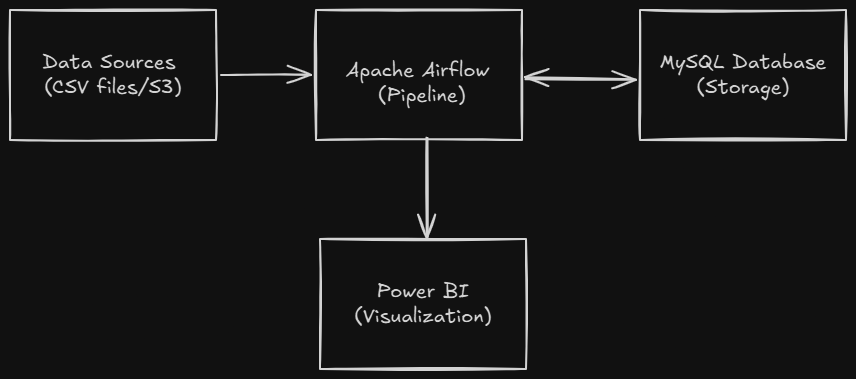

# EFT Banking Data Pipeline

### Overview
This repository contains a comprehensive banking data pipeline solution for EFT Corporation, including:
- **Airflow DAG** for daily data ingestion, transformation, and loading
- **Python data processing** with advanced validation and quality checks
- **SQL analytics queries** for reporting and dashboards
- **PowerBI dashboard** with sample data and visualizations
- **Complete infrastructure** setup using Docker Compose

### Architecture
#### EFT-Banking-Pipeline System Design diagram



## Quick Start

### Prerequisites
- Docker and Docker Compose
- Python 3.8+
- PowerBI Desktop (for dashboard)

### 1. Clone and Setup
```bash
git clone https://github.com/DavidOgalo/eft-banking-pipeline.git
cd eft-banking-pipeline

# Set environment variables
echo "AIRFLOW_UID=$(id -u)" > .env
echo "_AIRFLOW_WWW_USER_USERNAME=admin" >> .env
echo "_AIRFLOW_WWW_USER_PASSWORD=admin123" >> .env
```

### 2. Start Infrastructure
```bash
# Start all services
docker-compose up -d

# Wait for services to be ready (2-3 minutes)
docker-compose logs -f airflow-init

# Check service status
docker-compose ps
```

### 3. Access Services
- **Airflow Web UI**: http://localhost:8080 (admin/admin123)
- **MySQL**: localhost:3306 (eft_user/eft_password)

### 4. Generate Sample Data
```bash
# Generate PowerBI sample data
python generate_sample_data.py

# Or run in Docker
docker-compose exec airflow-webserver python /opt/airflow/dags/generate_sample_data.py
```

### 5. Run the Pipeline

1. Go to Airflow UI: http://localhost:8080
2. Enable the `banking_data_pipeline` DAG
3. Trigger a manual run or wait for scheduled execution (daily at 2 AM)
   
   **To trigger and monitor your DAG from the command line:**
   
   ```sh
   # Trigger the DAG manually
   airflow dags trigger banking_data_pipeline

   # List DAG runs and check status
   airflow dags list-runs -d banking_data_pipeline

   # View logs for a specific task and run
   airflow tasks logs banking_data_pipeline <task_id> <run_id>
   # Replace <task_id> (e.g., generate_mock_data) and <run_id> (from list-runs output)
   ```

   You can also monitor DAG progress, view logs, and manage runs interactively in the Airflow UI.


## Project Structure

```
eft-banking-pipeline/
├── airflow_home/
│   └──dags/
│       └── banking_data_pipeline.py      # Main Airflow DAG
├── src/
│   ├── data_processor.py             # Data transformation module
│   └── __init__.py
├── sql/
│   ├── banking_analytics.sql         # Analytics queries
│   └── init.sql                      # Database initialization
├── powerbi_data/                     # Generated sample data for PowerBI
│   ├── daily_transactions.csv
│   ├── anomaly_analysis.csv
│   ├── customer_analysis.csv
│   ├── bank_summary.csv
│   ├── monthly_trends.csv
│   ├── weekly_patterns.csv
│   ├── dataset_metadata.json
│   └── dax_measures.txt
├── docs/
│   ├── README.md
│   └── System Design Diagram 
├── generate_sample_data.py           # Sample data generator
├── docker-compose.yml                # Infrastructure setup
├── requirements.txt                  # Python dependencies             
└── venv                              # Environment variables
```

## Components Detail

### 1. Data Engineering Pipeline (Airflow)

#### DAG: `banking_data_pipeline`
- **Schedule**: Daily at 2:00 AM
- **Tasks**:
  1. `generate_mock_data` - Creates realistic banking transaction data
  2. `ingest_data` - Reads data from CSV files (simulating S3)
  3. `transform_data` - Cleans, validates, and aggregates data
  4. `load_to_mysql` - Loads processed data into MySQL
  5. `data_quality_check` - Validates loaded data quality

#### Key Features:
- Comprehensive error handling and retries
- Data quality scoring and validation
- Null value cleaning and type validation
- Duplicate detection and removal
- Statistical anomaly detection
- Business rule validation
- Comprehensive logging

### 2. Python Data Processing

#### `data_processor.py` Features:
- **Schema Validation**: Ensures required columns exist
- **Data Cleaning**: Handles nulls, invalid amounts, duplicates
- **Type Validation**: Converts and validates column types
- **Anomaly Detection**: Statistical outlier detection using z-scores
- **Quality Reporting**: Comprehensive data quality assessment
- **Business Rules**: Amount limits, date validation, bank ID formats

#### Quality Metrics:
- Total/valid record counts
- Null value statistics
- Data type conversion success rates
- Duplicate detection results
- Anomaly identification
- Overall quality score (0-100%)

### 3. SQL Analytics

#### Key Queries in `banking_analytics.sql`:
1. **Top 5 Banks by Volume (7 days)**
```sql
SELECT bank_id, SUM(total_volume) as total_transaction_volume
FROM daily_bank_aggregates
WHERE transaction_date >= DATE_SUB(CURDATE(), INTERVAL 7 DAY)
GROUP BY bank_id
ORDER BY total_transaction_volume DESC
LIMIT 5;
```

2. **Average Transaction Value per Customer (Monthly)**
```sql
SELECT bank_id, 
       SUM(total_volume) / SUM(unique_customers) as avg_transaction_value_per_customer
FROM daily_bank_aggregates
WHERE YEAR(transaction_date) = 2025 AND MONTH(transaction_date) = 9
GROUP BY bank_id
ORDER BY avg_transaction_value_per_customer DESC;
```

3. **Anomaly Detection with Moving Averages**
4. **Bank Performance Comparison**
5. **Time Series Analysis for PowerBI**

### 4. PowerBI Dashboard

#### Dashboard Components:
1. **Daily Total Transaction Volume**
   - Time series chart showing volume trends
   - Filter by bank and date range

2. **Top 5 Banks by Volume**
   - Bar chart with ranking
   - Drill-down by bank details

3. **Monthly Trend Comparison**
   - Month-over-month growth analysis
   - Seasonal pattern identification

4. **Anomalous Volume Detection**
   - Scatter plot with anomaly highlighting
   - Statistical threshold visualization

#### PowerBI Data Model:
- **Fact Table**: `daily_transactions` (main dataset)
- **Dimension Tables**: `bank_summary`, `customer_analysis`
- **Time Intelligence**: Date hierarchy (Year/Quarter/Month/Week/Day)
- **Measures**: 15+ DAX measures for analytics

#### Key DAX Measures:
```dax
Total Volume = SUM(daily_transactions[total_volume])

Volume Growth % = 
VAR CurrentPeriod = SUM(daily_transactions[total_volume])
VAR PreviousPeriod = CALCULATE(
    SUM(daily_transactions[total_volume]),
    DATEADD(daily_transactions[transaction_date], -1, MONTH)
)
RETURN DIVIDE(CurrentPeriod - PreviousPeriod, PreviousPeriod)
```

## Data Quality & Monitoring

### Quality Checks Implemented:
- **Completeness**: Required fields validation
- **Accuracy**: Amount range validation (0 < amount <= 1M)
- **Consistency**: Date format and logical validations
- **Uniqueness**: Duplicate transaction detection
- **Timeliness**: Future date identification
- **Statistical**: Anomaly detection using z-scores

### Monitoring Features:
- Real-time pipeline status in Airflow
- Data quality score per batch
- Anomaly detection alerts
- Processing time metrics
- Error rate tracking

## Production Deployment

### For Production, Consider:

1. **Security**:
   - Use secrets management (HashiCorp Vault, AWS Secrets Manager)
   - Implement proper authentication and authorization
   - Network security and VPN access

2. **Scalability**:
   - Use Kubernetes for container orchestration
   - Implement horizontal scaling for Airflow workers
   - Use cloud-managed databases (RDS, CloudSQL)

3. **Reliability**:
   - Multi-zone deployment
   - Automated backups and disaster recovery
   - Enhanced monitoring and alerting

4. **Data Sources**:
   - Replace mock data with real S3/API connections
   - Implement incremental data loading
   - Add data lineage tracking

## Sample Data

The solution includes comprehensive sample data generation:
- **180 days** of historical transaction data
- **7 banks** with different profiles and characteristics
- **Realistic patterns**: weekday/weekend effects, seasonal variations
- **Quality issues**: Simulated data quality problems for testing
- **Anomalies**: Statistical outliers for anomaly detection testing

## Development

### Running Tests
```bash
# Install development dependencies
pip install -r requirements.txt

# Run data processor tests
python src/data_processor.py
```

### Adding New Features
1. Update the Airflow DAG in `airflow_home/dags/banking_data_pipeline.py`
2. Modify data processing logic in `src/data_processor.py`
3. Add new SQL queries in `sql/banking_analytics.sql`
4. Update PowerBI dashboard with new visualizations

## Performance Metrics

Expected performance for the pipeline:
- **Data Processing**: ~10,000 records/minute
- **Pipeline Runtime**: 5-15 minutes for daily batch
- **Data Quality Score**: >95% for clean data
- **Anomaly Detection**: <2% false positive rate
- **Dashboard Refresh**: <30 seconds for 6 months of data

## Support

### Troubleshooting
1. **Airflow not starting**: Check Docker logs and ensure ports are free
2. **Database connection issues**: Verify MySQL service is running
3. **Pipeline failures**: Check Airflow logs for specific error messages
4. **PowerBI connection**: Ensure CSV files are generated and accessible
